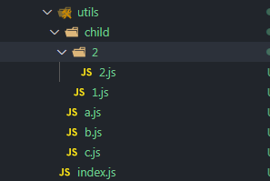
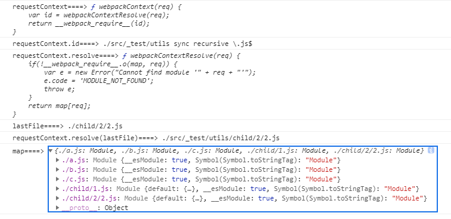

# require.context用法

## 前言

在开发的时候总会碰到整个文件夹下的文件都一起引入，特别是组件化开发的项目中，有一些基础组件，肯定会全部引进的，这样组件不多，一个个引没啥问题，但随着项目的扩展，组件可能会越来越多，每次新增一个组件都手动引入，这样太麻烦了。`webpack` 下有个批量引入文件的函数`require.context`，学习下这个函数的用法。

## 用法

看下`webpack` 官网的介绍 [require.context](https://www.webpackjs.com/guides/dependency-management/#require-context)  这个函数有三个参数。

- `directory` 引入文件的目录
- `useSubdirectories` 是否递归查找子目录
- `regExp` 正则匹配，需要查找的文件

这个函数会返回一个以`directory` 目录为上下文的函数`requestContext`。这个返回的函数有三个属性。

- `keys` 函数，返回的是个数组，这个数组的元素其实是一个路径，和`directory` 拼接就是当前调用`require.context` 的相对路径。

- `id` 是上下文模块里面所包含的模块 id. 它可能在你使用 `module.hot.accept` 的时候被用到。
- `resolve` 函数，这个函数传入`keys` 数组中的元素返回的是一个完整的路径。

函数`requestContext` 通过`keys` 的数组里的路径可以获取对应的文件内容。说那么多可能有点迷糊，直接来代码更直观一些。

## 实践

代码目录是这样的:

	

```javascript
src/_test/index.js
index.js
utils
|___a.js
|___b.js
|___c.js
|___child
|______1.js
|______2
|_________2.js
// index.js
const requestContext = require.context('./utils', true, /\.js$/);
const map = {};
let lastFile = '';
requestContext.keys().forEach((key) => {
  // key 就是一个路径
  // 路径传入requestContext就是引入文件的内容
  map[key] = requestContext(key);
  lastFile = element;
});

console.log('requestContext====>', requestContext);
console.log('requestContext.id====>', requestContext.id);
console.log('requestContext.resolve====>', requestContext.resolve);
console.log('lastFile====>', lastFile);
console.log('requestContext.resolve(lastFile)====>', requestContext.resolve(lastFile));
console.log('map====>', map);
```

看下打印的内容



点击看下`requestContext` 内部的具体实现

```javascript
var map = {
	"./a.js": "./src/_test/utils/a.js",
	"./b.js": "./src/_test/utils/b.js",
	"./c.js": "./src/_test/utils/c.js",
	"./child/1.js": "./src/_test/utils/child/1.js",
	"./child/2/2.js": "./src/_test/utils/child/2/2.js"
};


function webpackContext(req) {
	var id = webpackContextResolve(req);
	return __webpack_require__(id);
}
function webpackContextResolve(req) {
	if(!__webpack_require__.o(map, req)) {
		var e = new Error("Cannot find module '" + req + "'");
		e.code = 'MODULE_NOT_FOUND';
		throw e;
	}
	return map[req];
}
webpackContext.keys = function webpackContextKeys() {
	return Object.keys(map);
};
webpackContext.resolve = webpackContextResolve;
module.exports = webpackContext;
webpackContext.id = "./src/_test/utils sync recursive \\.js$";
```

看完内部代码就知道怎么回事了，`require.context` 内部会生成`map` 私有变量，通过`keys` 函数返回这个私有变量的所有`key` 。然后把`key`传给`webpackContext` ,`webpackContext` 通过`webpackContextResolve` 获取路径，然后把路径传入`__webpack_require__` ，这样就可以获取到文件内容了。

## 最后

这个函数在项目中会经常用到的，其实不止组件可以用这个，在使用大量`svg` 当图标的时候也可以用，这个`svg` 的用法具体可以看下`vue-element-admin-master` 这个的开源项目。