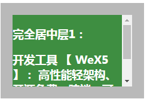

# CSS水平垂直剧中

## 绝对定位 + margin:auto

```html
<style>
  .wrp {
    background-color: #b9b9b9;
    width: 240px;
    height: 160px;
  }
  .box {
    color: white;
    background-color: #3e8e41;
    width: 200px;
    height: 120px;
    overflow: auto;
  }
  .wrp1 {
    position: relative;
  }
  .box1 {
    margin: auto;
    position:absolute;
    left: 0; right: 0; bottom: 0; top: 0;
  }
</style>
<div class="wrp wrp1">
    <div class="box box1">
        <h3>完全居中层1：</h3>
        <h3>开发工具 【 WeX5 】： 高性能轻架构、开源免费、跨端、可视化</h3>
    </div>
  </div>

```

> 剧中元素box1不需要计算大小。

### 效果图



## 绝对定位+margin反向偏移

```html
<style>
.wrp2 {
    position: relative;
  }
  .box2 {
    position:absolute;
    left: 50%; 
    top: 50%; 
    margin-left: -100px;
    margin-top: -60px;
  }
</style>
<div class="wrp wrp2">
    <div class="box box2">
        <h3>完全居中层2：</h3>
        <h3>开发工具 【 WeX5 】： 高性能轻架构、开源免费、跨端、可视化</h3>
    </div>
  </div>
```

> 剧中元素需要确认大小，margin 上 、左是元素对应高、宽一半，反向。

## 绝对定位+transform反向偏移

```html
<style>
.wrp3 {
    position: relative;
  }
  .box3 {
    position:absolute;
    left: 50%; 
    top: 50%; 
    transform: translate(-50%, -50%) // 和方案2一样
  }
</style>
<div class="wrp wrp3">
    <div class="box box3">
        <h3>完全居中层3：</h3>
        <h3>开发工具 【 WeX5 】： 高性能轻架构、开源免费、跨端、可视化</h3>
    </div>
  </div>
```

##  display: table

```html
<style>
  .wrp4 {
    display: table;
  }
  .sub4 {
    display: table-cell;
    vertical-align: middle
  }
  .box4 {
    margin: auto;
  }
</style>
 <div class="wrp wrp4">
    <div class="sub4">
        <div class="box box4">
            <h3>完全居中层4：</h3>
        </div>
    </div>
  </div>
```

##  display: inline-block

```html
<style> 
.box5 {
    display: inline-block;
    vertical-align: middle;
    width: auto;
    height: auto;
  }
  .wrp5::after {
    content: '';
    display: inline-block;
    vertical-align: middle;
    height: 100%;
  }
</style>
  <div class="wrp wrp5">
      <div class="box box5">
          <h3>完全居中层5：</h3>
      </div>
  </div>

```
## display: flex-box

```html
<style>
  .wrp6 {
    display: flex;
    justify-content: center;
    align-items: center;
  }
  .box6 {
    width: auto;
    height: auto;
  }
</style>
<div class="wrp wrp6">
      <div class="box box6">
          <h3>完全居中层6：</h3>
      </div>
  </div>
```
【转载】https://segmentfault.com/a/1190000006108996