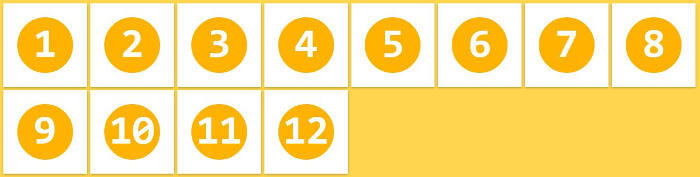

# flex-box布局

## Flex-box 布局

> flex 即是“弹性布局”，用来为盒状模型提供最大的灵活性。
>
> 任何一个容器都可以指定为flex布局
>
> **注意：** 设备Flex布局以后，子元素的`float` ,`clear`,和`vertical-align`属性将失效

```html
.box {
	display: flex; // 块级元素
	display: inline-flex; //行内元素
}
```

## 基本概念

> 采用Flex布局元素，称为Flex容器，它的所有子元素自动成为容器成员，称为Flex 项目，简称项目。
>
> 容器默认存在两根轴，水平的主轴（main axis）和垂直的交叉轴（cross axis）。
>
> 默认来说：main从左边开始 main start到右边main end；cross从上开始 cross start到下cross end。


## 容器的属性

### flex-direction

> 决定项目在主轴上的排序方向。

有四个值如下：

1. row(默认值)：主轴为水平方向，起点从左端开始排序。
2. row-reverse：主轴为水平方向，起点从右端开始排序。
3. column：主轴为垂直方向，起点从上沿开始排序。
4. column-reverse：主轴为垂直方向，起点从下沿开始排序。


### flex-wrap

> 默认情况下，项目都排在一条线（轴线）上。


有三个值：

1. nowrap(默认值)：不换行。

2. wrap： 换行，第一行在上方。

3. wrap-reverse：换行，第一行在下方。


### flex-flow

> flex-flow属性是flex-direction和flex-wrap属性的简写，默认值为 row nowrap

### justify-content

> 定义了项目在水平方向上的对齐方式。

有五个值，假设为水平方向为主轴：

1. flex-start（默认值）：左边对齐。
2. Flex-end：右边对齐。
3. center：剧中对齐。
4. space-between：两端对齐，项目之间的间隔都相等。
5. space-around：每个项目两侧的间隔相等。所以项目之间的间隔比项目与边框的间隔大一倍。


### align-items

> 定义项目在cross axis上如何对齐。

有五个值如下。cross方向从上到下。

1. flex-start：项目的上对齐。
2. flex-end：项目的下对齐。
3. center：cross 轴的中点对齐。
4. baseline：项目的第一行文字基线对齐。
5. stretch（默认值）：如果项目未设置高度或设为auto，将占满整个容器的高度。

### align-centent

> 定义 了多根轴线的对齐方式。如果项目只有一根轴线，该属性不起作用。

有六个值：

1. flex-start：和alin-items的值一样上对齐。
2. flex-end：和alin-items的值一样下对齐。
3. center：和alin-items的值一样中心对齐。
4. space-between：cross的两端对齐，轴线之间的间隔平均分布。
5. space-around：每根轴线两侧的间隔都相等。所以，轴线之间的间隔与边框的间隔大一倍。
6. stretch（默认值）：轴线占满整个cross axis。

## 项目属性

### order

> 定义项目的排序顺序。数值越小，排列越靠前，默认为0。


### flex-grow

> 定义项目的放大比例，默认为0，即如果在剩余空间，也不放大。
>
> 1. 如果值为1，项目放大且等分剩余空间。
> 2. 如果一个项目值为2，其他项目都为1，前者占据的剩余空间比其他项多一倍。


### flex-shrink

> 定义了项目缩小比例，默认为1，如果空间不足，该项目将缩小。
>
> 1. 所有项目的该属性都为默认值1时，当空间不足时，都将等比例缩小。
> 2. 如果一项目值为0，其他项目都为1，则空间不足时，前者不缩小。


### flex-basis

默认值为auto，如果轴上空间够大的话。设置的值和width或height一样，有固定的空间。


### flex

> flex是flex-grow, flex-shrink 和flex-basis的简写，默认值是 0 1 auto。后两个值是可选的。
>
> 该属性有两个快捷值：
>
> 1. auto: 1 1 auto。
> 2. none: 0 0 auto。


### align-self

> 该属性允许单个项目有与他项目不同的对齐方式，可覆盖align-items属性值，默认auto，表示继承父元素的align-items。如果没有父元素等同于stretch。
>
> 该属性有6个值，除了auto，其他与align-item一致。


转载：http://www.ruanyifeng.com/blog/2015/07/flex-grammar.html

转载代码：http://static.vgee.cn/static/index.html