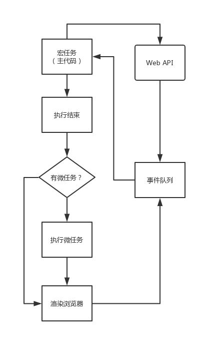

# JavaScript运行过程

## 加载

每个`script`标签的代码是独立的，但是共享全局作用域。如果有多个`script`标签，其中一个发生并抛出错误时并不会影响其他`script`标签代码运行。

- `<script src=''> ` 立即加载执行，阻塞HTML解析渲染。
- `<script defer src=''> ` 加载和HTML解析并行，但要等HTML解析完成才执行，且是按加载顺序执行，先于 `DOMContentLoaded` 事件执行。
- `<script async src=''> `加载和HTML解析并行，但加载完成立马执行，阻塞HTML解析渲染。执行是无序的。一定在load事件前面执行，但`DOMContentLoaded`  不确定。


## 作用域

加载完代码后，开始运行，这个运行根据个人理解是有两个阶段的，这两个阶段过程就是所谓的`VO(变量对象), AO(活动对象)` 。

### 第一个阶段

这是代码预编译阶段，主要是词法、语法分析，确定作用域（也就执行上下文）。

> **注意:**作用域是在这个时候，而不是在执行的时候确定的。
>
 ```javascript
 var a = 2;
 function bar() {
     console.log(a); // 2，作用域在第一阶段已确定
 }
 function foo() {
 	var a = 4;
     console.log(a); // 4
     bar();
 }
 foo();
 ```

 

首先是创建全局的执行上下文，也就是全局作用域，声明变量。这个时候只是声明变量而已，还没开始赋值，这个声明而没有赋值就说的是变量提升，但是函数的提升优先级比变量高。这些变量包含基本类型，对象，函数等，声明变量时，这些变量的变量名会作为作用域的属性名。作用域包含变量属性名的也叫`VO 变量对象 ` 。如果声明变量时类型是`Function` 的，会再创建一个作用域，这个作用域里的代码分析和全局作用域的一样，只不过这个`function`的作用域是挂在全局作用域上的，如果函数里还有函数过程一样，内嵌函数作用域挂外层函数的作用域上，这就形成了**作用域链**。

在`JavaScript` 里作用域只有全局作用域和局部作用域（函数作用域），`eval和with` 也可以创建作用域，但不常用，最好也不要用。`ES6`之前是没有块级作用域的，但在`ES6`的时候加了`let const`这两个后就有了块级作用域的说法了，且用这两个声明的变量不存在变量提升，详情请看`ES6`语法

```javascript
a = 2; // 执行阶段才赋值
var a; // 编译阶段就声明了
console.log(a); // 2;

// ============================================
// 函数的优先级更高
console.log(foo); // foo Function
console.log(foo());// 3
var foo = 2;
console.log(foo); // 2
console.log(foo()); // 报错：Uncaught TypeError: foo is not a function	
function foo() {
    return 3;
}
console.log(foo); // 2
console.log(foo()); //报错：Uncaught TypeError: foo is not a function	 
```


### 第二个阶段

第一阶段完成后开始执行代码。

首先把全局作用域推入栈中，开始对变量赋值然后执行代码，也就是说变量值的确定是在执行阶段确定的，这个赋值就是所谓的`（VO => AO）`的转变，这是作用域变量对象到活动对象的转变。**执行过程遇到作用域会继续把它推入栈中，形成一个作用域栈队列**。栈的特点是先进后出，当最上面的作用域对应的函数执行完成，会移出栈的队列，直到最底的全局作用域移除，整个栈队列为空，这时程序执行完成。

> 注意：正常来说，作用域移出栈后，作用域里所有变量所分配的内存会被当垃圾回收，然后作用域被销毁。然而这里有一种情况就是，这个作用域移出栈外是临时的，因为这个作用域内还有变量被子作用域的变量所引用，不能被垃圾回收器回收，当子作用域被激活时，移出栈外的父作用域和子作用域同时又会被推入栈中。这就是说**闭包**的情况。

 ```javascript
 function foo() {
     var a = 2; // 被 bar 的作用域引用，就是foo的子作用域（好像是没有子作用域的说法）
     function bar() {
         return a;
     }
     return bar;
 }
 var baz = foo();
 console.log(baz()) // 2;
 ```

 
## 垃圾回收器

上面说到作用域的变量被垃圾回收器回收，那变量什么时候会被回收呢？

`JavaScript`在定义变量时会自动分配内存，当变量不再使用时，会被回收，但是怎么样判断变量不再使用呢？

`JavaScript引擎`有两种回收算法。

### 引用计数算法

定义变量后，可能有其他变量引用，也可能没有。当有其他变量引用时，该变量被引用次数为1次引用，被引用多少次就计数多少次，当释放引用后就减少引用次数，当引用为零时被回收。

这个算法有个限制那就是**循环引用** 时，不会被回收，这就有可能出现内存益出的情况。

如`IE6，8`使用计数方式对DOM对象回收时，常造成循环引用发生内存泄漏。

```javascript
var div;
window.onload = function() {
    div = document.getElementById('idtest');
    div.dataEle = div;
    div.lotsOfData = new Array(10000).join("*");
}
```

### 标记清除法

引用计数算法的限制，标记清除法则不存在这个问题，现代所有浏览器都使用了该算法作为垃圾回收算法。

这个算法就是定期从全局作用域开始查找所引用的对象，还有对象引用的对象。垃圾回收器将找到所有可以获得的对象和不可获取的对象。不可获得的对象被当垃圾回收。这就像一棵树，从根开始向上找，能找到的都在树上，找不到的都在树下，树下的就是垃圾。

这里也有一个限制就是无法从根上找到的对象都被回收，这也是算法的核心。当然这种可用的对象应用场景很少，所以不太用关心。

## 事件循环

JS引擎是单线程的，不存在并发编程，但JS存在异步编程，通过事件循环实现的。

JS代码在执行过程中会触发各种各样的事件，如异步的`ajax回调` `setTimeout，setInternal的定时事件` 还浏览器触发的同步事件如`onclick` 等，同步事件还好，触发就立马执行了，但是异步的事件是什么时候触发的呢？

这里有两个概念`macrotask`和 `microtask`：

`macrotask`又称宏任务或者主任务，就是主代码块和其他产生的异步事件。

`microtash`又称微任务，`Promise，Process.nextTick`。

1、首先主代码执行，执行过程产生的异步事件推到事件队列中，微任务推到微任务队列中。

2、主代码执行完成后，判断是否有微任务，有就执行，没有就渲染浏览器。

3、渲染完浏览器后下一个宏任务开始（先判断是否有事件，先执行事件）。

```javascript
console.log('start');
setTimeout(() => {
    console.log('setTimeout');
}, 3000);
Promise.resolve('Promise').then((val) => {
    console.log('Promise')
})
console.log('end');
// start
// end
// Promise
// setTimeout
```

事件循环如下图：



## 最后

这里的总结只是JS执行过程的简化而已，实际上比这里说的复杂的多，由于初始涉及不是很深入，如有错误，请各位纠正。

