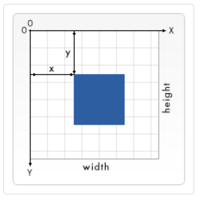

# SVG基本知识

## 概念

可缩放矢量图形（Scalable Vector Graphics，SVG）基于 XML 标记语言，用于描述二维的矢量图形。

## 如何使用

1. 直接嵌入到HTML中，当成HTML的元素
2. 可以在img中引入（img元素和img样式）
3. 可以使用object元素引入
4. 通过javascript动态标签创建插入到HTML中

## 属性和元素

### 视窗坐标系

以画布为基础，也就是SVG元素在所在位置，左上角为原点，X轴向右和Y轴向下为正。



### 属性

不填写width,height, viewbox属性时，svg的默认宽高为300x150

- viewbox

SVG可以理解成有两个坐标系：视窗坐标系和用户坐标系。这两个坐标系开始是重叠的。视窗坐标系是svg画布本身，不会被修改。而用户坐标系是会被修改的。就是通过viewbox属性
填写值为minx, miny, widht, height。
这个属性的作用可以这样理解，在画布上裁剪出一个宽高分别为widht，height的区域，然后这个区域水平移动minx个单位，垂直移动miny个单位，但是原坐标不变，最后把画布上的内容填充到这个剪出的区域。
可以看出minx, miny实际是原点的坐标
缩放
当viewbox的宽高小于svg的宽高时，整个svg内容为放大效果。
当viewbox的宽高大于svg的宽高时，整个svg内容呈现为缩小的效果

## SVG动画

https://zhuanlan.zhihu.com/p/383245453

https://juejin.cn/post/7083262239569870856#heading-0

### SMIL

主要是在svg里添加动画元素
https://developer.mozilla.org/zh-CN/docs/Web/SVG/SVG_animation_with_SMIL

### CSS

svg可以作为元素直接嵌入到html中，也就是说css也可以对svg的元素生效，所以css的动画也作用于svg的元素。css的动画主要是通过animation, transition, transform三个属性让元素动起来。

- animation，引用一个keyframes
- transition，某些属性的过度效果
rect {
    transition: fill 1s linear;
    fill: red;
}
rect:hover {
    fill: green;
}
- transform，让元素变形

Transform可以让元素平移、缩放、旋转，值得注意的是对于html和svg元素，transform变换参考的坐标系不一样。svg元素是参考自身的坐标系，即是viewport的左上角。而html的是元素的中心位置。

```html
<!DOCTYPE html>
<html lang="en">

<head>
    <meta charset="UTF-8">
    <meta name="viewport" content="width=device-width, initial-scale=1.0">
    <title>Document</title>
    <style>
        rect {
            width: 200px;
            height: 200px;
            fill: red;
            transition: fill 2s linear;
            transform: rotate(10deg);
        }
        rect:hover {
            fill: green;
        }
        .box {
            border: 1px solid #333;
            position: relative;
        }
        .ibox {
            width: 200px;
            height: 200px;
            background-color: aqua;
            transform: rotate(10deg);
            position: absolute;
        }
    </style>
</head>

<body>
    <div class="box">
        <div class="ibox"></div>
        <svg>
            <rect />
        </svg>
    </div>
</body>

</html>
```

### JS

## 实践

- 描边动画

描边动画主要是使用stroke-dasharray 和 stroke-dashoffset两个属性实现。
stroke-dasharray，的值是一个数值序列，该序列详尽的定义了描边样式中每个实线段与间隙（空白段）的相对长度。

1. 单一值，仅有一个数值时，此数值决定了实线段与间隙的长度，两者呈现出等长且规律交替的虚线形态
2. 序列值的数值个数为偶数。奇数位置的值对应实线的长度，偶数位置的数值则对应相邻实线之间的间隙（空白段）长度。
3. 序列值的数值个数为奇数。浏览器会自动复制当前序列值拼接在原序列之后，确保最终得到一个偶数长度的循环序列，然后按照上述偶数个数值的规则来绘制虚线。

- stroke-dashoffset，这属性的值决定了描边起始绘制的位置相对于实际路径的偏移量。随着stroke-dashoffset的值变化，原本固定的虚线仿佛沿着路径缓缓滑动，形成动画效果。

- stroke-dasharray，是画虚线的，值是一个序列。虚线是由多组实线和实线后的间隙组成。这个序列值就是描述每组实线和间隙的长度的。当画虚线时，是按这个序列值循环来画的。

```html
<style>
path {
    stroke-dasharray: 10;
    stroke-dasharray: 10 5;
    stroke-dasharray: 10 5 20; // 这里的值最终为 10 5 20 10 5 20
}
</style>
```

## SVG实践遇到的问题

offset-rotate的影响
坐标受g元素的translate影响
