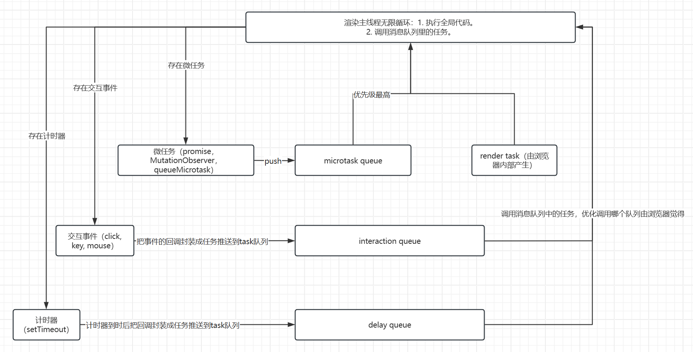

# 事件循环

## 处理过程

事件循环是浏览器中最重要的机制之一，JS是运行在属于单线程的渲染线程中，事件循环就是让单线程可以处理异步任务的机制。

1. 浏览器加载页面后，渲染主线程开始无限循环处理任务。
2. （这里不说HTML解析）开始先执行全局的JS代码（script标签中的代码），执行过程中，遇到异步任务时，会将其放到事件队列中。

> 事件队列有很多，不同类型事件有自己的队列
>
> - 脚本（script）
> - 微任务（promise，MutationObserver，queueMicrotask）
> - 定时器（setTimeout、setInterval）
> - 事件监听（addEventListener、attachEvent）
> - 其他异步操作（XMLHttpRequest、fetch、WebSocket 等）
> - 渲染任务（reflow、repaint） 由浏览器产生，一般会根据硬件的刷新率时间生成

## 事件优化级

全局JS代码执行完毕后，渲染线程会检查事件队列，发现有任务，就会从队列中取出一个任务执行，执行过程中，遇到异步任务时，会将其放到事件队列中。

1. 微任务队列是优先级最高的，只要是渲染线程空闲，就会优先执行微任务队列中的任务，直到该微任务队列清空为止（包括微任务中产生的微任务事件推送到微任务队列中）。
2. 微任务队列清空后， 渲染线程会检查是否需要渲染页面，如果需要，就会进行渲染。
3. 渲染完成后，渲染线程会去检查其他事件队列，按照优先级顺序依次执行其他事件队列中的任务，其他事件队列中的任务执行完毕后，，然后继续循环处理任务。




## 事件循环示例

```js
console.log('1 script start');

setTimeout(function() {
  console.log('8 setTimeout');
}, 11);

setTimeout(function() {
  console.log('5 setTimeout Promise');
  Promise.resolve().then(function() {
    console.log('6 setTimeout inner promise1');
  }).then(function() {
    console.log('7setTimeout inner promise2');
  });
}, 10);

Promise.resolve().then(function() {
  console.log('3 promise1');
}).then(function() {
  console.log('4 promise2');
});

console.log('2 script end');
```

```
// 输出结果
1 script start
2 script end
3 promise1
4 promise2
5 setTimeout Promise 10ms
6 setTimeout inner promise1
7 setTimeout inner promise2
8 setTimeout
```

## 参考

[官方文档](https://html.spec.whatwg.org/multipage/webappapis.html#concept-agent-event-loop) 中的事件循环章节
