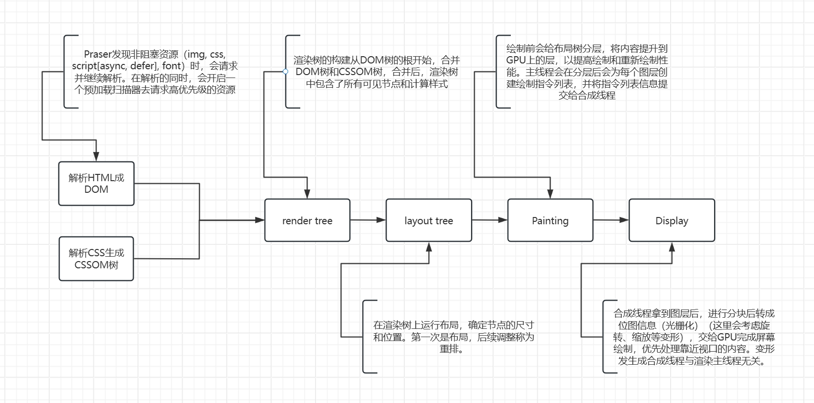
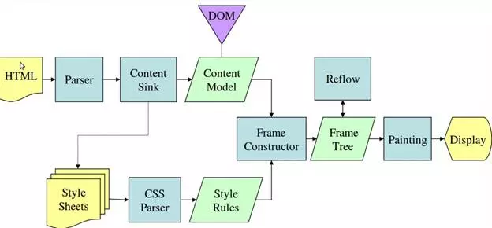

# 浏览器渲染

## 浏览器进程

浏览器是多进程架构。

- 浏览器进程（Browser Process）：管理 UI、标签页、扩展等，协调其他进程。
- 渲染进程（Renderer Process）：每个标签页或 iframe 通常有一个渲染进程，负责 HTML/CSS 解析、JavaScript 执行、布局和绘制。
- 网络进程（Network Process）：统一处理网络请求，如 HTTP、HTTPS、WebSocket 等。
- GPU 进程：处理图形渲染。
- 插件进程、扩展进程等（视情况而定）。

## 渲染进程（每个标签页一个）

渲染进程启动后，会开启一个渲染主线程，**渲染主线程** 负责处理渲染相关的任务，如解析HTML、渲染DOM树、处理CSS样式、执行JavaScript代码等。

默认情况下，浏览器会为每个标签页开启一个渲染进程，以保证不同的标签页之间的互不干扰。
（后续可能是每个站点开启一个渲染进程，而不是每个标签页一个进程，以提高资源利用率。也就是说合并进程。）

渲染进程中的线程：

- 渲染主线程，负责处理渲染相关的任务。
- 预解析线程，负责预解析HTML中的外部资源（link/img/script/video/audio），提前发现并请求资源。
- 合成线程 (Compositor Thread)：负责把渲染层合成到屏幕上，实现流畅滚动。
- 光栅化线程 (Raster Thread)：把矢量的绘制指令转成位图。
- IO 线程：处理网络请求、文件读写。
- Worker 线程：Web Worker / Service Worker，可以做计算，但不能直接操作 DOM。

## 渲染主线程

### 渲染的第一步，解析HTML（Parsing HTML）

下载HTML后，开始解析HTML，解析过程遇到CSS解析CSS，遇到JS执行JS。

为了提高效率，浏览器开始解析前，会启动一个**预解析**的线程，率先下载HTML中的外部资源（如CSS、JS、图片等）。

- **CSS不会阻塞HTML解析的原因**

如果主线程解析到link元素位置，此时外部CSS文件还没下载解析好，主线程不会等待，继续解析后续的HTML。
这是因为下载和解析CSS的工作是在预解析线程中进行的。

- **JS会阻塞HTML解析的原因。**

如果主线程解析到script元素位置，会停止解析HTML,转而等待JS文件下载好，并将全局代码解析并执行完成后才会继续解析HTML。
这是因为JS代码的执行过程可能会修改当前的DOM树，所以DOM树的生成必须暂停。

第一步完成后，会得到 DOM 树 和 CSSOM 树，浏览器的默认样式、内部样式表、外部样式、 行内样式均会包含在CSSOM树中。

### 渲染的第二步，样式计算（Style Calculation）

主线程会遍历得到DOM树，依次为每个节点 计算出它的最终样式，称这为Computed Style。
这个过程中，很多预设值会变成绝对值，如em、rem、%等；相对单位会变成绝对单位，如px。

这一步完成后，会得到一棵带有Computed Style的DOM树。

### 渲染的第三步，布局（Layout）

布局阶段会依次遍历DOM树中的每个节点，计算出每个节点的几何信息。例如节点的宽高、相对包含块的位置等。

大部分时候，DOM 树 和布局树并非一一对应。

如display: none;的元素没有几何信息，会出现在dom树，但不会出现在布局树中。
伪元素（::before、::after）不会出在dom树中，但有几何信息，所以会出现在布局树中。
还有匿名行盒、匿名块盒等等都会导致 DOM 树 和布局树 出现不一致的情况。

### 渲染的第四步，分层（Layer）

主线程会使用一套复杂的策略对整个布局树进行分层。

分层的好处在于，将来某一个层改变后，仅会对该层进行后续处理，而不会影响其他层，从而提高渲染效率。
滚动条，堆叠上下文（Stacking Context），transform, opacity等样式都会或多或少的影响分层结果，也可以通过will-change属性更大程度的影响分层结果。

### 渲染的第五步，绘制（Painting）

主线程会为每个图层创建一个绘制指令列表，绘制指令列表中包含了该图层的所有绘制操作。
完成绘制后，主线程会将绘制指令列表信息提交给**合成线程**。
剩余工作将由合成线程完成。

## 合成线程

### 【合成线程】渲染的第六步，分块（Tiling）

合成线程会将图层分块，将其划分为更多的小区域。
合成线程会从线程池中拿出多个线程来完成分块工作。
分块的作用是为了提高渲染效率,如可视区域块优先渲染。

### 【合成线程】渲染的第七步，光栅化（Raster）

将块信息转换为位图，这个过程称为光栅化。
合成线程会将每个块信息交给GPU进程，以极高的速度完成光栅化。
GPU进程会开启多个线程来完成光栅化，并且优先处理靠近视口区域的块。
光栅化的结果，就是一块一块的位图。

### 【合成线程】渲染的第八步，画（Draw）

合成线程拿到每个层、每个块的位图后，生成一个个【指引（quad）】信息。
指引会标识出每个位图应该画到屏幕的哪个位置，以及会考虑到旋转、缩放等变形。
变形发生在合成线程，与渲染主线程无关，这是**transform**效率高的本质原因。
合成线程会把 quad 提交给GPU进程，由GPU进程产生系统调用，提交给GPU硬件，完成屏幕绘制。

为什么交给GPU进程，因为渲染进程在沙盒里运行无法调用系统功能。



## webkit渲染过程


## Gecko渲染过程



-------------------

由图可知：CSS的加载不会阻塞DOM树的解析，但会阻塞渲染。

## CSS会阻塞JS吗

```html
<!DOCTYPE html>
<html lang="en">
<head>
  <meta charset="UTF-8">
  <meta name="viewport" content="width=device-width, initial-scale=1.0">
  <meta http-equiv="X-UA-Compatible" content="ie=edge">
  <title>Document</title>
  <!-- <link rel="stylesheet" href="style.css" /> -->
  <style>
    div {
      color: red;
    }
  </style>
  <script>
    console.log('before css');
    var st = Date.now();
  </script>
  <link href="https://cdn.bootcss.com/bootstrap/4.0.0-alpha.6/css/bootstrap.css" rel="stylesheet">
  <script src="async.js" async></script>
  <script src="defer.js" defer></script>

</head>
<body>
    <div id="box">
      test
    </div>
    <script>
        console.log('after css');
        console.log(Date.now() - st);
    </script>
</body>
</html>
```

```js

// async.js
console.log("✅ JS 执行了 async");

// defer.js
console.log("✅ JS 执行了 defer");
```

把浏览器下载速度调用低可以看出，CSS加载会阻塞后面的JS执行， 但不会阻塞async里的代码执行。

```text
before css
✅ JS 执行了 async
after css
5894
✅ JS 执行了 defer
```

### 同步脚本（`<script>` 无 async 或 defer）

**CSS会阻塞JS执行**

- 当浏览器解析HTML遇到`script`标签时，会暂停HTML解析（阻塞DOM构建），加载并执行JS
- script在link（css文件）之后，JS执行会等待CSS文件加载完成并构建CSSOM。
  - 原因是：JS 可能访问 CSSOM（如 window.getComputedStyle 或 element.style），浏览器需要确保 CSSOM 就绪以避免不一致的结果。

### 异步脚本（`<script async>`）

**CSS不会阻塞JS执行**

- async脚本在加载完成后，会立即执行，不等待HTML解析或CSSOM构建。
- JS 执行不等待 CSS 加载完成，如果在脚本中访问了 CSSOM，可能返回不完整的样式信息（因为 CSSOM 未构建完成）。

### 延迟脚本（`<script defer>`）

**CSS会阻塞JS执行**

- defer脚本在HTML解析完成后，（DOMContentLoaded事件触发前）执行，会按照defer的顺序执行。
- JS执行通常等待CSSOM构建完成，因为 defer 脚本会在 DOMContentLoaded 前运行，而浏览器通常确保 CSSOM 就绪以支持渲染。

### 内联脚本（`<script>` 标签内）

**CSS会阻塞JS执行**

- 内联脚本立即执行，暂停 HTML 解析。
- 如果 `<link>` 在内联脚本之前，脚本执行会等待 CSSOM 构建完成。
- 如果 CSS 是内联 `<style>`，则无需等待外部加载，CSSOM 立即可用。

### 其他脚本

- 动态加载脚本，通过 document.createElement('script') 动态加载的脚本不会等待 CSSOM，除非脚本显式依赖 CSSOM（如 getComputedStyle）。
- Web Worker 或 Service Worker 中的 JS 运行在独立线程，不访问 DOM/CSSOM，因此不受 CSS 加载影响。

### 执行顺序

由上到下：

1. 同步js，css，按顺序执行。
2. async js，加载完成就执行。
3. defer脚本在HTML解析完成后，（DOMContentLoaded事件触发前）执行，会按照defer的顺序执行

> 由于JS会修改html和css，因此浏览器会维持html中的js和css的执行顺序。

## DOMContentLoaded

> onLoad事件就是所有资源都加载完成时触发，而DOMContentLoaded在DOM解析完成后触发。
> onLoad事件执行在DOMContentLoaded后触发。

​	遇到JS代码时，等到执行完成JS代码时才会继续解析HTML；在执行JS代码的这个过程，浏览器还是会预解析HTML的，但和主线程解析不同，预解析只会做准备工作，把解析好的内容放到内存中，如果中间有资源要加载就会去加载，但不会渲染。

## CSS图层

每个图层，渲染，计算位置大小都相互不影响。这个图层和PS里的图层差不多。
如果有出现gif图的，这个图所在的图层会一直处于重绘状态。这时可以给它单独开一个图层减少开销。

**生成图层条件**

- 拥有具有3D变换的CSS属性。
- `<video> <canvas>`  节点
- CSS3动画节点
- 拥有CSS加速属性的元素（will-change:transform）
- 元素有一个`z-index` 较低且包含一个复合层的兄弟元素（换句话说就是该元素在复合层上面渲染）

## 面试题

1. 如果理解 JS 的异步？

这是因为 JS 是在属于渲染线程中执行的，这个渲染线程是单线程的，不止负责运行JS，还要负责渲染页面。
如果是同步的话，碰到计时器，点击事件等，就会立即执行，后面的任务会被当前事件阻塞，如计时器，需要等到对应的时间才执行回调，导致线程什么都做不了，一直在等待，不仅浪费资源，还会导致页面卡顿， 出现卡死现象。
如果是异步的话，碰到计时器，点击事件等，就会交给其他线程执行，其他线程在对应时机把回调推到消息队列末等待渲染线程调用，而渲染线程继续执行消息队列里的任务，这样就不会阻塞渲染线程了， 页面也不会卡顿， 出现卡死现象。且渲染线程会一直循环检查消息队列，如果有任务，就会立即执行，没有任务就会等待。这样就能最大限度的保证单线程的执行效率。[事件循环](./事件循环)

2 什么是 reflow？

reflow 的本质就是重新计算 layout树。
当页面的几何信息发生变化时，就会触发 reflow。
为了避免连续的多次操作导致布局树反复计算，浏览器会合并这些操作，当 JS 代码全部完成后再进行统一计算。所以改动属性造成的 reflow 是异步完成的。
由于异步完成reflow的，当JS 获取布局属性时，就可能造成无法获取到最新的布局信息。
浏览器在权衡下，最终决定获取属性立即 reflow。

3. 什么是 repaint？

repaint 的本质就是重新根据分层信息计算了绘制指令。
当页面的外观发生变化时，就会触发 repaint。
如改变元素的颜色、背景颜色、边框颜色等。
由于元素的布局信息也属于可见样式，所以reflow 一定会引起 repaint。

4 为什么 transform 的效率高？

因为 transform 既不会影响布局也不会影响绘制指令，它影响的只是渲染流程最后一个draw阶段，由于draw阶段在合成线程中，所以transform的变化几乎不会影响主线程。反之渲染主线程无论如何忙碌，也不会影响transform的变化。

## 参考

1. [参考1](https://zhuanlan.zhihu.com/p/43282197)