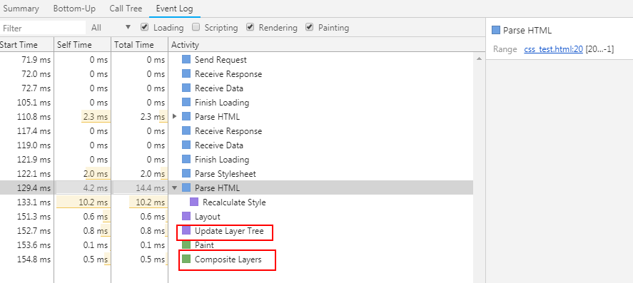

# 浏览器原理

浏览器是属于多进程的。

1、主进程，主控，协调；

2、第三方进程，一个插件对应一个进程；

3、GPU进程，3D绘制；

4、浏览器渲染进程，每个tab对应一个渲染进程，互不影响。

​	主要是页面渲染、脚本执行、事件处理等。

## 事件循环

主执行栈---> 微任务--->渲染 ---> 主执行栈


## 从输入 RUL 到页面加载完成发生了什么事

- `DNS解析`
- TCP连接
- 发送HTTP请求
  - 浏览器对同一域名的并发请求是有数量限制的，不同浏览器限制数量不一样。
  - 每个请求都会主动添加cookie到请求头。
  - 这个数量限制主要考虑到：端口数量、线程切换开销，还有服务器压力等。
  - 和并发数有关技术：
    - `domain hash` 增加并发数量。
    - `cookie free` `CDN`，减少cookie传输带来的消耗。
    - `css sprites` 多张图片合成 一张，通过background的定位引用同一张图片。
    - `js/css combine` `js/css`模块化来减少重绘重排。
- 服务器处理请求并返回HTTP报文
- 浏览器解析渲染页面

## 渲染引擎

- `IE (Trident) -ms-`
- `Safari(Webkit) -webkit-`
- `Chrome;Opera(Blink) 基于webkit`
  - `Chrome -webkit- `
  - `Opera -o-`
- `Firefox(Gecko) -moz-`
- 通过`autoprefixer `工具添加前缀，不要手动添加。

引擎包括：HTML解析器，CSS解析器，布局layout模块，javascript引擎，绘图模块等。

## 渲染进程

> 渲染进程是浏览器的内核，也是核心，主要对面进行解析，渲染，展现；该进程是多线程的。

1、GUI渲染线程

- 解析HTML，CSS，构建DOM树， render树，布局和绘制等。
- 重绘、重排进会触发执行该线程。
- 注意，**GUI渲染线程和JS引擎线程是互斥的**，当JS引擎执行时，GUI会被挂起，GUI更新会被保存在一个队列中等到JS引擎空闲时立即被执行。

2、JS引擎线程

- 负责解析、运行JavaScript代码。
- 一个渲染进程只有一个JS线程，这就是说的单线程。
  - 如果是多线程的，对DOM的操作会造成混乱，处理问题更新复杂。
- **GUI渲染线程与JS引擎线程是互斥的** JS的执行会阻塞页面的渲染。

3、事件触发线程

- 控制事件循环。
- `Web API` 时将对应任务添加到事件线程中，如`setTimeout，ajax` 。
- 当对应事件符合触发条件时，事件线程会事件添加到待处理队列的队尾，等待JS引擎处理。
- 事件处理以后总结。

4、定时触发器线程

- `setInterval`与`setTimeout`所在线程。
- 浏览器定时计数器不是由JS引擎计数的。
  - 由于JS引擎是单线程的，如果处于阻塞状态，会影响计时准确。
- 计时完成会触发该线程执行任务，如添加事件到事件队列中。

5、异步http请求线程

- XMLHttpRequest在连接后通过浏览器新开一个线程请求。
- 检测到状态变更时，如果有回调函数，该线程就产生状态变更事件，把事件放到事件队列中。

6、问题

细心的看官可能发现问题了。
这里有一个`事件队列`，该队列是由JS引擎线程维护，还有一个事件触发线程。
那么问题来了，把事件添加`事件队列`中的是`事件线程`还是其他`生成该事件的线程`？或者是部分事件由`事件线程`添加？

如果有哪位了解的可否给笔者详情说道说道？


## 渲染过程

1、获取页面资源。

2、解析HTML生成DOM树。

3、解析CSS生成CSSOM树。

4、将DOM树和CSSOM树结合生成渲染树。

​	生成渲染树的过程应该是对各个元素的位置大小计算，还有图层的划分，即是布局。


5、绘制、合成这些图层然后展示。

**webkit渲染过程**


**Gecko渲染过程**


-------------------

由图可知：CSS的加载不会阻塞DOM树的解析，但会阻塞渲染。

## CSS会阻塞JS吗

```html
<!DOCTYPE html>
<html lang="en">
<head>
  <meta charset="UTF-8">
  <meta name="viewport" content="width=device-width, initial-scale=1.0">
  <meta http-equiv="X-UA-Compatible" content="ie=edge">
  <title>Document</title>
  <!-- <link rel="stylesheet" href="style.css" /> -->
  <style>
    div {
      color: red;
    }
  </style>
  <script>
    console.log('before css');
    var st = Date.now();
  </script>
  <script src=""></script>
  <link href="https://cdn.bootcss.com/bootstrap/4.0.0-alpha.6/css/bootstrap.css" rel="stylesheet">
</head>
<body>
    <div id="box">
      test
    </div>
    <script>
        console.log('after css');
        console.log(Date.now() - st);
    </script>
</body>
</html>
```

把浏览器下载速度调用低可以看出，CSS加载会阻塞后面的JS执行。

> 由于JS会修改html和css，因此浏览器会维持html中的js和css的执行顺序。

## DOMContentLoaded

> onLoad事件就是所有资源都加载完成时触发，而DOMContentLoaded在DOM解析完成后触发。
> onLoad事件执行在DOMContentLoaded后触发。

​	遇到JS代码时，等到执行完成JS代码时才会继续解析HTML；在执行JS代码的这个过程，浏览器还是会预解析HTML的，但和主线程解析不同，预解析只会做准备工作，把解析好的内容放到内存中，如果中间有资源要加载就会去加载，但不会渲染。

## CSS图层

每个图层，渲染，计算位置大小都相互不影响。这个图层和PS里的图层差不多。
如果有出现gif图的，这个图所在的图层会一直处于重绘状态。这时可以给它单独开一个图层减少开销。

**生成图层条件**

- 拥有具有3D变换的CSS属性。
- `<video> <canvas>`  节点
- CSS3动画节点
- 拥有CSS加速属性的元素（will-change:transform）
- 元素有一个`z-index` 较低且包含一个复合层的兄弟元素（换句话说就是该元素在复合层上面渲染）
- 其他

## 重绘（repaint）

重绘是一个元素外观的改变所触发的浏览器行为，如outline，背景颜色等属性。重绘不会重新布局，所以并不一定伴随重排。

注意：如果图层中的某个元素重绘，整个图层都需要重绘。

## 重排（reflow 回流）

渲染对象在创建完成并添加到渲染树时，并不包含位置和大小信息。计算这些值的过程称为布局或重排。

注意：重排必然导致重绘。

## 最后

了解了浏览器渲染原理后，可以根据这个对前端知识的补充，很快就会形成一个知识体系，不然总是零零碎碎的知识很难有大体上的把握。比如要优化前端性能从哪里开始，首先人框架上解决，如CDN，图片合成，减少HTTP请求。还有代码上的优化，如CSS的图层渲染或减少重绘重排，JS的尾调用优化等。

下遍继续总结下JS引擎的运行代码的过程。

这遍文章查看了好多资源总结的，如有错误请指出。

## 部分参考

https://juejin.im/post/5b88ddca6fb9a019c7717096

https://segmentfault.com/a/1190000012925872

https://www.zhihu.com/question/20474326