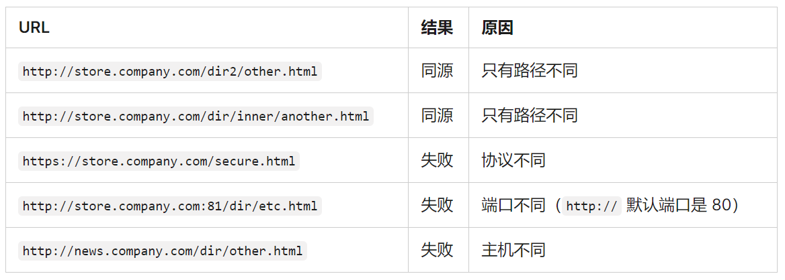

# 跨域

## 同源策略

[同源策略](https://developer.mozilla.org/zh-CN/docs/Web/Security/Same-origin_policy)是一种安全策略，用于限制一个源地址的文档或它加载的脚本如何能与另一个源的资源进行交互。它可以减少恶意文档攻击。

## 同源定义

协议，域名，端口必须一致匹配才能算同源。


## 同源限制内容

- Cookie，LocalStorage，IndexDB等存储性内容
- DOM节点
- AJAX请求发送后，结果被浏览器拦截了
- [字体资源请求](https://developer.mozilla.org/zh-CN/docs/Web/HTML/CORS_enabled_image) xxx.(eot|ttf|ttc|otf|eot|woff|woff2|svg)
- Canvas 跨域图片限制

有三个标签是允许跨域访问资源的。

- ``
- `<link href=xxx>`
- `<script src=xxx>`

跨域请求实际上是发出去了，且服务器是正常响应的，只是浏览器拦截了响应的结果并抛出一个错误。如果没有经过第三方同意，这里限制的是从一个域名获取第三方域名的内容。

## 解决方案

### 1、JSONP

jsonp利用script标签不受同源限制，通过scrip的src做接口请求，返回数据。

**局限：**

1. 需要后端配合。
2. 只能使用GET方法。

**原理：**

1. 和后端协商好定义一个回调函数，通过接口参数传给后端。
2. 创建scrip标签，把接口赋值给标签的src属性，并把标签追加到body
3. 后端把数据当成回调函数的参数形式，且把回调函数以调用函数的格式返回给浏览器
4. 前端定义好这个回调函数，并通过这个回调函数的参数接收数据
5. 由于返回的调用函数格式，所以接口成功后浏览器会自动调用当前函数

```js

// server.js
const express = require('express');
const app = express();
app.get('/jsonp', (req, res) => {
    const {callback, ...params} = req.query
    res.end(`${callback}('hello jsonp', ${JSON.stringify(params)})`);
})
app.listen(3000);

// index.html
function jsonp(url, params, callback) {
    return new Promise((resolve) => {
        const scriptEl = document.createElement('script');
        window[callback] = function(...args) {
            resolve({...args});
            document.body.removeChild(scriptEl);
        }
        params = { ...params, callback };
        const pairVals = Object.keys(params).map((key) => `${key}=${params[key]}`)
        scriptEl.src = url + `?${pairVals.join('&')}`;
        document.body.appendChild(scriptEl);
    })
}

jsonp('http://127.0.0.1:3000/jsonp', { test: 'name'}, 'show').then((res) => {
    console.log(res) // '{"0":"hello jsonp","1":{"test":"name"}}'
})

```

### 2、CORS（跨域资源共享）

cors需要浏览器和后端服务同时支持，IE8和9需要通过XDomainRequest 来实现。实际上这里主要是通过服务器的配置，支持该功能的浏览器会自动进行跨域通信。所以这功能不需要前端配置。
虽然不需要前端配置。但是在跨域时，资源请求分两种情况。

**1）简单请求**

只要同时满足以下两大条件，就是简单请求：

**条件1：使用以下方法之一**

- GET
- HEAD
- POST

**条件2：Content-Type仅限于以下三个中的一个：**

- text/plain
- multipart/form-data
- application/x-www-form-urlencoded

请求中的任意 XMLHttpRequestUpload 对象均没有注册任何事件监听器； XMLHttpRequestUpload 对象可以使用 XMLHttpRequest.upload 属性访问。

**2）复杂请求**

不符合简单请求的就是复杂请求了。复杂请求在正式请求前，会有一次预请求，向服务器询问，可以使用的请求域名、方法，请求头等内容判断当前请求是否支持跨域。该请求使用的方法是options，该次请求被称为预检。

#### CORS 标头

**Access-Control-Allow-Origin**
指示响应的资源是否可以被给定的来源共享。

**Access-Control-Allow-Credentials**
指示当请求的凭证标记为 true 时，是否可以公开对该请求响应。

**Access-Control-Allow-Headers**
用在对预检请求的响应中，指示实际的请求中可以使用哪些 HTTP 标头。

**Access-Control-Allow-Methods**
指定对预检请求的响应中，哪些 HTTP 方法允许访问请求的资源。

**Access-Control-Expose-Headers**
通过列出标头的名称，指示哪些标头可以作为响应的一部分公开。

**Access-Control-Max-Age**
指示预检请求的结果能被缓存多久。

**Access-Control-Request-Headers**
用于发起一个预检请求，告知服务器正式请求会使用哪些 HTTP 标头。

**Access-Control-Request-Method**
用于发起一个预检请求，告知服务器正式请求会使用哪一种 HTTP 请求方法。

**Origin**
指示获取资源的请求是从什么源发起的。

#### Cookies

跨域时，如果需要传Cookie的话，需求设置以下内容

1. 前端需要设置Credentials， fetch为credentials:"include"， xhr为withCredentials
2. 响应头Access-Control-Allow-Credentials为true
3. 响应头Access-Control-Allow-Origin不能为*
4. 如果存在Access-Control-Request-Headers，响应头Access-Control-Allow-Headers不能为*，值要和Access-Control-Request-Headers的值保持一致。

字体文件跨域，如何带上cookie???

```js
// server.js
/// <reference types="express">
const express = require('express');
const app = express();

app.use((req, res, next) => {
    res.setHeader('Access-Control-Allow-Origin', 'http://127.0.0.1:8080')
    res.setHeader('Access-Control-Allow-Headers', 'content-type')
    res.setHeader('Access-Control-Allow-Credentials', true)
    res.setHeader('Access-Control-Max-Age', 10)
    console.log('====> use', req.url, req.method)
    if (req.method === 'OPTIONS') {
        res.send();
        return; // 不加这一行报Cannot set headers after they are sent to the client
    }
    next();
})
app.use(express.static('static'))

app.get('/corss', (req, res) => {
    console.log('====> corss', req.url, req.method)
    res.send('express corssss')
});

app.listen(3000);

// cors.html

document.cookie = 'name=test'
fetch('http://127.0.0.1:3000/corss', {
    credentials:"include",
    headers: {
        'content-type': 'application/json'
    }
}).then((res) => {
    res.text().then(console.log)
})
```

### 3、postMessage 跨域通信

[postMessage](https://developer.mozilla.org/zh-CN/docs/Web/API/Window/postMessage)是window的一个属性，可以实现跨域通信。

```html

<body>
    Hello outer postMessage
    <iframe style="display: block;" id="frame" onload="load()" src="http://127.0.0.1:4000/post.html"></iframe>
    <script>
        function load() {
            console.log('load...')
            const frame = document.getElementById('frame');
            frame.contentWindow.postMessage('hello inter frame', 'http://127.0.0.1:4000');
            window.onmessage = function(e) {
                console.log(e.data); // hello outer frame
            }
        }
    </script>
</body>
<-- http://127.0.0.1:4000/post.html -->
<body>
    Hello inter postMessage<span>test tag</span>
    <script>
        window.onmessage = function(e) {
            console.log(e.data); // hello inter frame
            e.source.postMessage('hello outer frame', e.origin)
        }
    </script>
</body>
```

### 4、WebSocket

[websocket](https://developer.mozilla.org/zh-CN/docs/Web/API/WebSocket)是浏览器的一个API，主要和后端实现全双工通信，且支持跨域。
```js

/// <reference types="express">

// server.js
const WebSocket = require('ws');
const wss = new WebSocket.Server({ port: 3344 });
wss.on('connection', (ws) => {
    ws.on('message', (data) => {
        console.log(Buffer.from(data).toString());
        ws.send('hello client ws')
    })
})
// ws.html
let socket = new WebSocket('ws://127.0.0.1:3344');
socket.onopen = function () {
    socket.send('hello server ws');//向服务器发送数据
}
socket.onmessage = function (e) {
    console.log(e.data);//接收服务器返回的数据
}

```

### 5、Node中间件代理

### 6、Nginx代理

### 7、window.name + iframe

window.name设置窗口名称，作不同window的区分，这个属性的值最大值不超过2MB。使用window.name做跨域传消息是利用设置值加载后，在不同页面，不同的域展现依然存在。
原理：
要实现 http://127.0.0.1:8080/a.html 和 http://127.0.0.1:4000/b.html两个页面跨域通信。如在a页面获取b页面的数据。

1. 在b.html里设置window.name = 数据。
2. 在a.html里使用iframe标签加载b.html。加载b.html成功后，替换iframe的src到a页面同源页面（http://127.0.0.1:8080/c.html，中间页面）
3. 当c.html页面加载成功后就可以通过window.name获取b.html页面里设置的数据了。

```html
// a.html
<body>
    <iframe style="display: block;" id="frame" onload="load()" src="http://127.0.0.1:4000/b.html"></iframe>
    <script>
        let first = true;
        function load() {
            const frame = document.getElementById('frame');
            if (first) {
                frame.src = 'http://127.0.0.1:8080/c.html'
                // 下面这一行后报错，跨域不能获取dom操作
                // Uncaught DOMException: Blocked a frame with origin 
                // "http://127.0.0.1:8080" from accessing a cross-origin frame.
                console.log(frame.contentWindow.name)
                first = false;
            } else {
                console.log(frame.contentWindow.name) // 打印 iframe inner window name
            }
        }
    </script>
</body>

// b.html
<body>
    <script>
        window.name = 'iframe inner window name'
    </script>
</body>
```

### 8、location.hash + iframe

和window.name有点类似，只不过这里是使用中间页面修改hash，然后在页面监听hash变化以获取的数据。
原理：

http://127.0.0.1:8080下有a.html 和 b.html，http://127.0.0.1:3000下有c.html，现在是a要和c跨域通信，b是中间页面。

1. a页面通过iframe标签加载c页面里，可以在hash后面赋上数据，这样c可以获取到a数据。
2. c页面通过iframe标签加载b页面，给b的地址hash加上数据，即是c给b赋值。
3. b页面加载后，通过window.parent.parnet.location.hash = location.hash，即可获取到c页面给的值。
4. 在a页面监听hash的变化，即可获取到c传过来的数据。

```html
// a.html
<body>
    <iframe style="display: block;" id="frame" src="http://127.0.0.1:3000/c.html#hash-content"></iframe>
    <script>
        window.name = 'location-hash'
        window.onhashchange = function() {
            console.log(location.hash); // 打印 #cross-data
        }
    </script>
</body>

// c.html
<body>
    <script>
        console.log(location.hash) // 打印 #hash-content
        const frame = document.createElement('iframe');
        frame.src = 'http://127.0.0.1:8080/b.html#cross-data'
        document.body.appendChild(frame)
    </script>
</body>

// b.html
<body>
    <script>
        // window.parent.parent，既是a页面
        window.parent.parent.location.hash = location.hash
    </script>
</body>
```

### 9、document.domain

[document.domain](https://developer.mozilla.org/zh-CN/docs/Web/API/Document/domain) 主要用在有相同父级域名的不同子级域名或父级域名和子级域名的跨域通信。该API已废弃，不该使用。

原理：
如，b.local.com:8080/b.html 和 a.local.com:8080/a.html通信，在a和b页面同时设置
document.domain = 'local.com'

```html
// a.html
<body>
    Hello domain a
    <iframe style="display: block;" src="http://b.local.com:8080/domin-b.html"></iframe>
    <script>
        document.domain = 'local.com'
        console.log('Hello domain a')
    </script>
</body>

// b.html
<body>
    Hello domain b
    <script>
        document.domain = 'local.com'
        console.log(window.parent.document) // 设置document.domain = 'local.com'后正常访问
        console.log('Hello domain b')
    </script>
</body>
```

## 参考

https://juejin.cn/post/6844903767226351623
